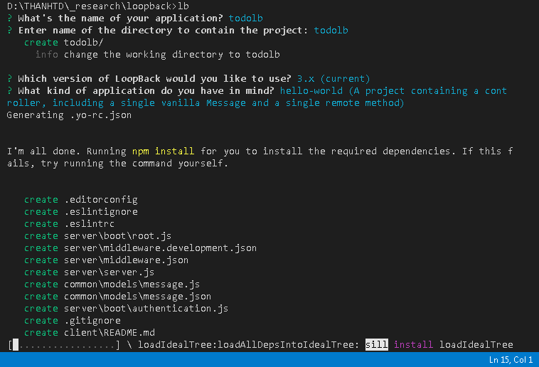

Cài đặt Node.js nếu chưa có

Cài đặt loopback 

`npm install -g loopback-cli`

Mở VSCode lên, browse tới thư mục chứa ứng dụng ( đặt tên là todolb)

Chạy loopback command (run on Terminal) để bắt đầu khởi tạo ứng dụng

`lb`

Trả lời tuần tự tập câu hỏi tương tác của Loopback CLI như: tên của ứng dụng (`todolb`), thư mục chứa sourcecode của ứng dụng (`todolb`), version của loopback (lastest version của loopback ở thời điểm viết bài này là lb3 `3.x (current)`), chọn template cho loại ứng dụng của bạn (`hello-world`)

Sau khi hoàn thành khởi tạo ứng dụng, di chuyển vào thư mục `todolb` chứa source để tiếp tục

`cd todolb`

