#### Khởi tạo Model
Loopback đã định nghĩa sẵn 1 số các Model thường dùng (`in-build Model`) như: User, Role và Application. Chúng ta có thể sử dụng hoặc kế thừa từ những in-build Model này để phù hợp với yêu cầu cụ thể.

Với ứng dụng này, mình cần apply việc xác thực User qua Email. Vậy nên mình sẽ tạo lại model Account (đặt khác tên so với in-build User model) , kế thừa từ model User.

Thực thi lệnh tạo model:

`lb model`

Trả lời các gợi ý về thông tin model cần tạo theo trình `Loopback model generator`: Nhập tên model (`Account`), Chọn datasource (ở ví dụ này sử dụng `db (memory)`), chọn kế thừa từ model `User`, và cho phép tự động trích xuất REST API cho model này (`Y`), chọn `common` model để có thể sử dụng được cả server lẫn client.

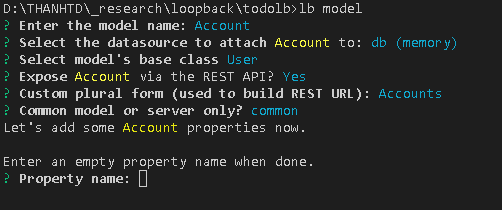

Nhấn tiếp Enter để thoát

Bây giờ bạn có thể run app bằng cách thực thi command:

`node .`

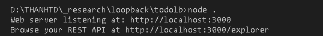

Kết quả API Explorer tại http://localhost:3000/explorer:

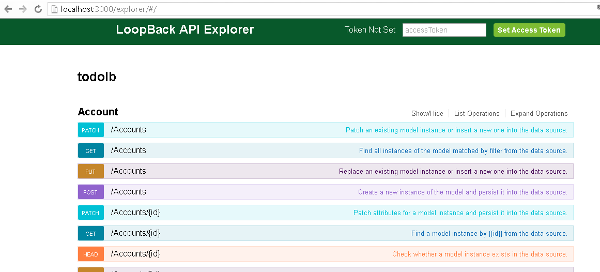

Set lại model User là private, để không cho phép truy cập User qua API.

ở `model-config.json`
``` json
"User": {
    "dataSource": "db",
    "public": false
  },
```
run lại app sẽ thấy tab User không được hiển thị trên Explorer nữa.

Bạn có thể thử test 1 vài API cơ bản, như tạo 1 Account bằng cách thực hiện `POST /Accounts` và test lại bằng cách thực hiện `GET /Accounts`

Lưu ý: Loopback User bắt buộc phải có `Email` ngược lại `username` thì tùy chọn.

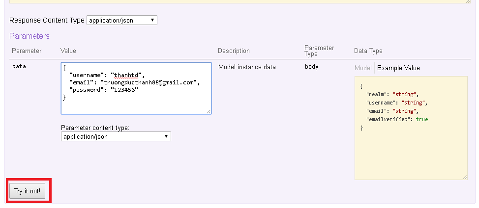

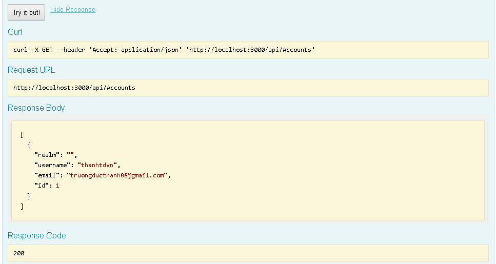

Test API `PATCH /Accounts/{id}` để cập nhật thông tin tài khoản vừa được tạo, với `id` là Id của tài khoản cần cập nhật.

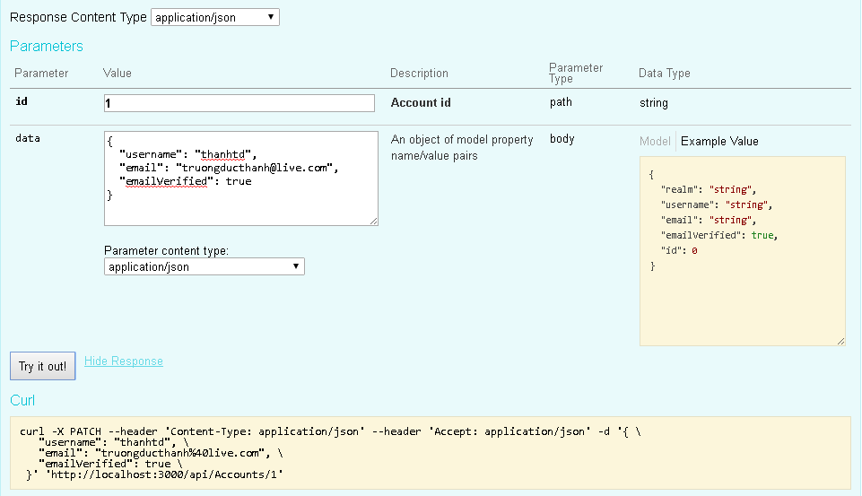

API này cần xác thực người dùng qua AccessToken, vậy nên bạn sẽ nhận được response 401 `AUTHORIZATION_REQUIRED`

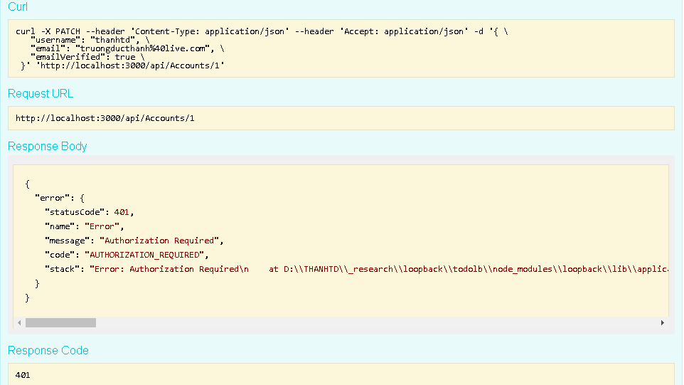

Để lấy AccessToken, mình sẽ thực hiện API `POST /Login` để login vào hệ thống

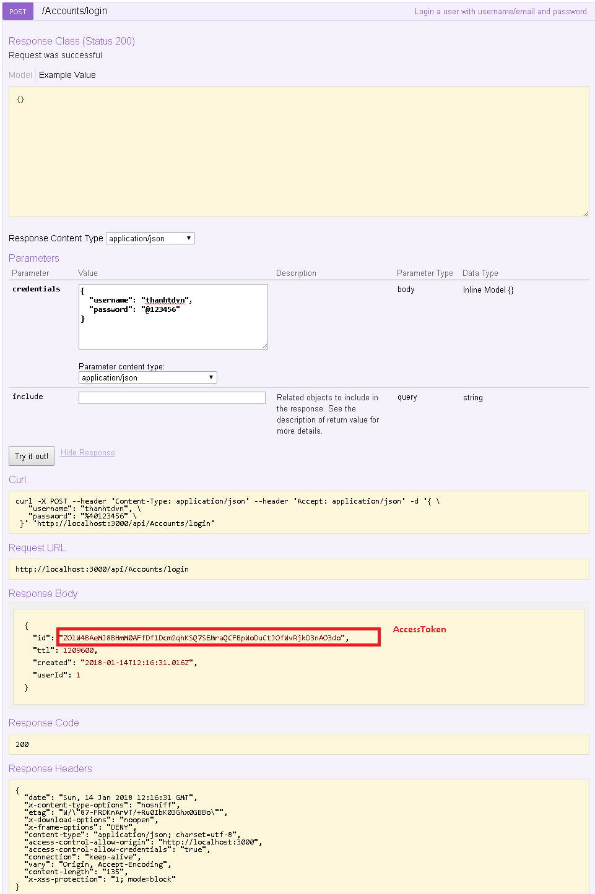

Sau khi có được access_token, ta sẽ set token cho các request bằng cách , nhập access_token vào input ở top-bar, nhấn `Set Access Token` để cập nhật.

Bây giờ ta thử lại việc cập nhật thông tin tài khoản (với access_token) bằng cách run API `PATCH /Accounts/{id}`, ta sẽ thấy kết quả trả về thành công.

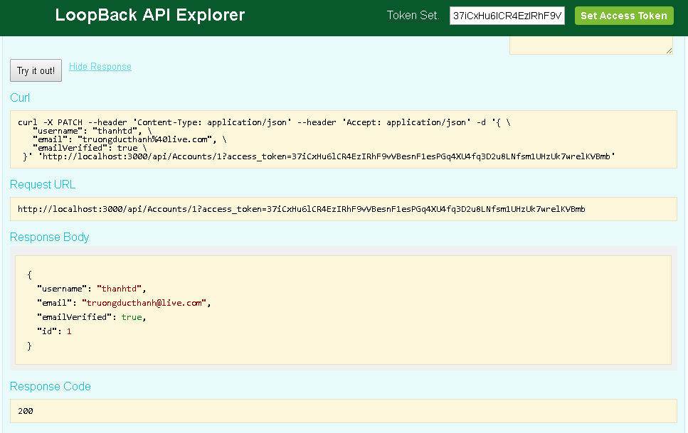

Bạn có thể thử test các tương tự khác trong API Explorer.

#### Xác thực người dùng qua Email

http://loopback.io/doc/en/lb3/Email-connector.html

Để bật tính năng xác thực tài khoản qua Email, cần thực hiện 1 số bước sau:

- Bật verify tài khoản qua Email: bằng cách vào `/common/models/account.json` set `"emailVerificationRequired": true`

``` json
{
  "name": "Account",
  "plural": "Accounts",
  "base": "User",
  "idInjection": true,
  "options": {
    "validateUpsert": true,
    "emailVerificationRequired": true
  },
  "properties": {},
  "validations": [],
  "relations": {},
  "acls": [],
  "methods": {}
}

```

- Tạo Email datasource :

Thực thi các command-line sau:

`lb datasource` 

Chọn connector là Email

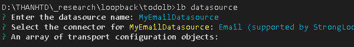

- Cấu hình email datasource
 
 Cấu hình email datasource bằng cách edit file `/server/datasources.json`

Ở đây mình sẽ cấu hình sử dụng Gmail làm mail server.

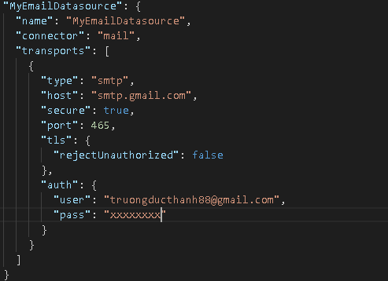

- Kết nối model tới Email data source

tiếp đó, ta kết nối Account model tới MyEmailDatasource vừa tạo bằng cách edit file `/server/model-config.json` 

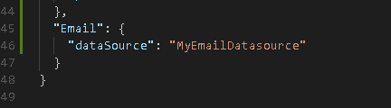

#### Đăng ký
Như vậy các bước để đăng ký 1 user sẽ là:
1. Gọi API `POST accounts` để tạo tài khoản

2. Gửi mail xác thực người dùng

Để thực hiện việc gửi email xác thực đăng ký này ta sử dụng `remote hook`.

Một `remote hook` sẽ chạy trước hoặc sau 1 remote method của model. Tham khảo thêm tại http://loopback.io/doc/en/lb3/Remote-hooks.html


Trong trường hợp này ta cần định nghĩa 1 `remote hook` chạy sau khi tài khoản được tạo `create`

Ở đây `create` là remote method được gọi thông qua REST API `POST accounts`

``` js
module.exports = function(Account) {
    //send verification email after registration
    Account.afterRemote('create', function(context, acc, next) {
    var options = {
      type: 'email',
      to: acc.email,
      from: senderAddress,
      subject: 'Thanks for registering.',
      template: path.resolve(__dirname, '../../server/views/verify-view.ejs'),
      redirect: '/verified',
      user: acc
    };

    acc.verify(options, function(err, response) {
      if (err) {
        Account.deleteById(acc.id);
        return next(err);
      }
      context.res.render('response-view', {
        title: 'Signed up successfully',
        content: 'Please check your email and click on the verification link ' +
            'before logging in.',
        redirectTo: '/',
        redirectToLinkText: 'Log in'
      });
    });
  });

```

trong đó:

options: là cấu hình gửi mail với mail template là `/server/views/verify-view.ejs`

gọi phương thức `acc.verify(options, ...` để gửi mail:

nếu thất bại thì sẽ xóa Account `Account.deleteById(acc.id);`

nếu thành công thì render ra view `/server/views/response-view.ejs`

Lưu ý: để sử dụng view template thì phải config trong `/server/server.js`

``` js
// configure view handler
app.set('view engine', 'ejs');
app.set('views', path.join(__dirname, 'views')); 

```

Test lại API tạo account ta được response như sau:

``` html
<h1>Signed up successfully</h1>

  <p>Please check your email and click on the verification link before logging in.</p>

<a href="/">Log in</a>
```

#### Xác thực tài khoản
Bước gửi mail xác thực tài khoản được thực hiện ở bước đăng ký tài khoản ở trên cũng có thể gọi trực tiếp thông qua API: `POST /accounts/{id}/verify`

Kết quả, một email gửi đến người dùng chứa đường link để thực hiện xác thực tài khoản. Kiểm tra email, click link xác thực tài khoản. Link này sẽ gọi tới API xác thực tài khoản. `GET /accounts/confirm`

``` html
Thanks for registering. Please follow the link below to complete your registration.

http://0.0.0.0:3000/api/Accounts/confirm?uid=1&redirect=%2F&token=ebc9d88c94294d6c7b67acbae636d2abc306959069b13f9b5cff975539e8cc2286c45f5d777bce524f4ebceda1287bc575b9c45b211d8fafac798218e46b300f
```

#### Đăng nhập
`POST /accounts/login` 

Bạn phải cung cấp 1 username hoặc email và password trong request body. Ngoài ra cũng có thể set thêm thời gian sống `(ttl)` mong muốn đối với access_token. API sẽ xác thực tài khoản và trả về status code `200` nếu OK 

** Nếu không set `ttl`, hệ thống sẽ tự động set 1 thời gian sống mặc định ( tính bằng giây) cho access_token đó.
Ví dụ:

Request URL: POST  http://localhost:3000/accounts/login

Request body:
``` json
{
    "email": "truongducthanh88@gmail.com",
    "password": "*******",
    "ttl": 86400
  }
```
Response status code: 200

Response body:
``` json
{
  "id": "PqosmmPCdQgwerDYwQcVCxMakGQV0BSUwG4iGVLvD3XUYZRQky1cmG8ocmzsVpEE",
  "ttl": 86400,
  "created": "2018-01-16T08:31:33.464Z",
  "userId": 1
}
```
với `id`: access_token tương ứng với phiên làm việc hiện tại của user.

#### Reset mật khẩu
`POST /users/reset`

Khi server nhận được yêu cầu reset-password, nó sẽ phát ra (emit) 1  sự kiện `resetPasswordRequest` và tạo 1 access_token tạm thời để có thể gọi reset mật khẩu.

Trong account.js, đăng ký 1 event handler để xử lý cho sự kiện `resetPasswordRequest` trên :

``` js
//send password reset link when requested
  Account.on('resetPasswordRequest', function(info) {
    var url = 'http://' + config.host + ':' + config.port + '/reset-password';
    var html = 'Click <a href="' + url + '?access_token=' +
        info.accessToken.id + '">here</a> to reset your password';

    Account.app.models.Email.send({
      to: info.email,
      from: senderAddress,
      subject: 'Password reset',
      html: html
    }, function(err) {
      if (err) return console.log('> error sending password reset email');
      console.log('> sending password reset email to:', info.email);
    });
  });
```

Event handler này sẽ gửi 1 email cho user chứa đường link để reset mật khẩu với 1 access_token tạm thời.

Ở ví dụ này, mình sẽ tạo 1 endpoint cho việc xử lý reset mật khẩu, trong routes.js:

``` js
//show password reset form
  app.get('/reset-password', function(req, res, next) {
    if (!req.accessToken) return res.sendStatus(401);
    res.render('password-reset-view', {
      redirectUrl: '/api/accounts/reset-password?access_token='+
        req.accessToken.id
    });
  });
```
Route này sẽ kiểm tra request hợp lệ với 1 access_token tạm thời, sau đó render form reset mật khẩu từ view template `password-reset-view`, với redirectUrl là api `POST accounts/reset-password`.

Đoạn code này chỉ làm việc khi bạn chắc chắn đã cài đặt sử dụng middleware `bodyParser` và `loopback-token` để có thể parse json data ở body và check access_token trong cookies, header hay query string của request.

ở `/server.js`
``` js
// configure body parser
app.use(bodyParser.urlencoded({extended: true}));
app.use(loopback.token());
```

Submit form reset-password này sẽ gọi đến api `POST /accounts/reset-password?access_token= {req.accessToken.id}`

Để render ra UI trang thông báo thành công, bạn có thể tạo `remote-hook` xử lý cho tác vụ này:

ở `/models/account.js`
``` js
//render UI page after password reset
  Account.afterRemote('setPassword', function(context, acc, next) {
    context.res.render('response-view', {
      title: 'Password reset success',
      content: 'Your password has been reset successfully',
      redirectTo: '/',
      redirectToLinkText: 'Log in'
    });
  });
```

#### Thay đổi mật khẩu

`POST /Accounts/change-password`


