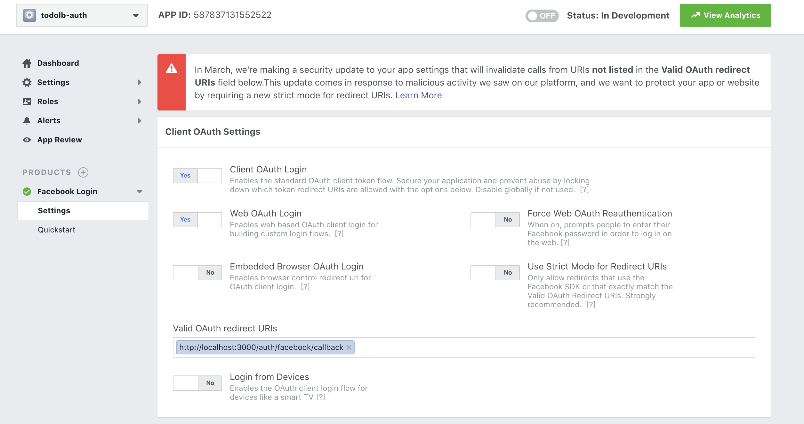
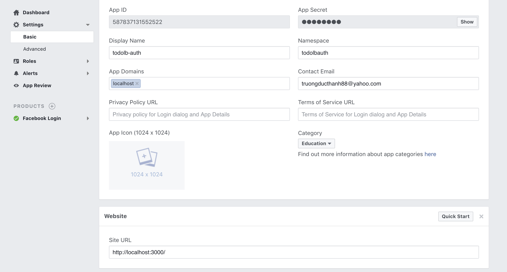
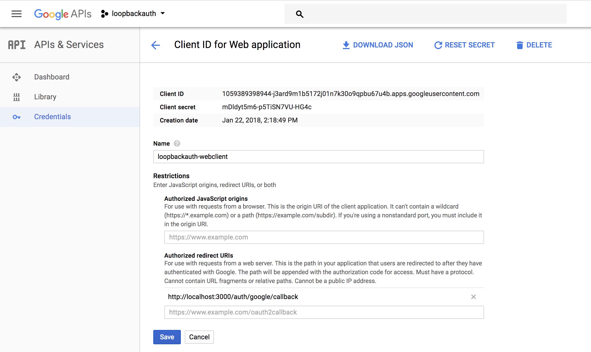

### Cài đặt
Từ Terminal, chạy command sau để cài đặt `loopback-passport-component` và `Passport`.

```js
npm install loopback-component-passport

npm install passport

```
### Cấu hình

#### Cấu hình providers.json

Cấu hình các xác thực qua các provider trong file `providers.json`

Sẽ đi vào chi tiết cấu hình từng provider ở bên dưới

#### Models
Ta định nghĩa lại các Passport models và thiết lập quan hệ với model Account của ứng dụng.

Định nghĩa các models: 

AccountCredential kế thừa UserCredential 

``` json
{
  "name": "AccountCredential",
  "plural": "AccountCredentials",
  "base": "UserCredential",
  "properties": {},
  "validations": [],
  "relations": {
    "user": {
      "type": "belongsTo",
      "model": "Account",
      "foreignKey": "userId"
    }
  },
  "acls": [],
  "methods": []
}
```

AccountIdentity kế thừa UserIdentity
```json
{
  "name": "AccountIdentity",
  "plural": "AccountIdentities",
  "base": "UserIdentity",
  "properties": {},
  "validations": [],
  "relations": {
    "user": {
      "type": "belongsTo",
      "model": "Account",
      "foreignKey": "userId"
    }
  },
  "acls": [],
  "methods": []
}
```

3rdAccessToken kế thừa AccessToken
```json
{
  "name": "3rdAccessToken",
  "plural": "3rdAccessTokens",
  "base": "AccessToken",
  "properties": {},
  "validations": [],
  "relations": {
    "user": {
      "type": "belongsTo",
      "model": "Account",
      "foreignKey": "userId"
    }
  },
  "acls": [],
  "methods": []
}
```

Thêm các cấu hình cho các model này trong model-config.json

```json
  "3rdAccessToken": {
    "dataSource": "db",
    "public": false
  },
  "AccountCredential": {
    "dataSource": "db",
    "public": false
  },
  "AccountIdentity": {
    "dataSource": "db",
    "public": false
  }
```


Khai báo các models được sinh ra bởi `loopback-component-passport`  bằng cách thêm `../node_modules/loopback-component-passport/lib/models` vào trong mảng `sources`

##### Cài đặt logic xác thực qua passport cho ứng dụng


Ta cài đặt logic chứng thực qua passport trong file `server/server.js`

trong đó:

- khởi tạo 1 Passport Configurator

``` js
// Passport configurators..
var loopbackPassport = require('loopback-component-passport');
var PassportConfigurator = loopbackPassport.PassportConfigurator;
var passportConfigurator = new PassportConfigurator(app);
```

- Load các cấu hình passport provider từ file `providers.json`

``` js

// attempt to build the providers/passport config
var config = {};
try {
  config = require('../providers.json');
} catch (err) {
  console.trace(err);
  process.exit(1); // fatal
}

```

- Khởi tạo passport
``` js
passportConfigurator.init();
```

- Cài đăt/ khái báo các model liên quan
``` js

passportConfigurator.setupModels({
  userModel: app.models.user,
  userIdentityModel: app.models.userIdentity,
  userCredentialModel: app.models.userCredential,
});
```

- Cấu hình passport strategies từ các thiệt lập cho các provider
``` js

for (var s in config) {
  var c = config[s];
  c.session = c.session !== false;
  passportConfigurator.configureProvider(s, c);
}
```

Ngoài ra ta cần cài đặt 1 số component khác:

`express-flash` để có thể hiện thị passport errors

`connect-ensure-login`: middleware đảm bảo user đã được xác thực, trong trường hợp user chưa xác thực -> redirect về trang login.


#### Đăng nhập bằng facebook
Chúng ta đã cài đặt loopback-component-passport ở trên để cho phép xác thực qua passport. Bây giờ để cho phép xác thực qua facebook, ta chỉ cần cài đặt component `passport-facebook` và cấu hình facebook provider ở `providers.json`

Cài đặt component `passport-facebook`:

`npm install passport-facebook `


Cấu hình chứng thực qua Facebook

```json
{
    "facebook-login": {
        "provider": "facebook",
        "module": "passport-facebook",
        "profileFields": ["gender", "link", "locale", "name", "timezone",
          "verified", "email", "updated_time"],
        "clientID": "587837131552522",
        "clientSecret": "d17385b3c2c7e9511759629517154cb4",
        "callbackURL": "/auth/facebook/callback",
        "authPath": "/auth/facebook",
        "callbackPath": "/auth/facebook/callback",
        "successRedirect": "/auth/account",
        "failureRedirect": "/login",
        "scope": ["email"],
        "failureFlash": true
    }
}
```

trong đó:

- clientID và clientSecret là thông tin AppID và AppSecret của facebook app tương ứng mà bạn đăng ký dùng để xác thực qua facebook.
- profileFields là các trường thông tin cần lấy từ user's profile và phải được cho phép từ tài khoản facebook.
- scope là facebook scope yêu cầu tài khoản facebook cho phép được truy cập


Đăng ký 1 facebook app từ `https://developers.facebook.com/apps`.

Từ menu, My Apps / Add a new App -> hiển thị popup để tạo app

Điền tên của app ở Display NameName và email vào mục Contact Email -> xong nhấn Create AppApp ID

Ở phần Add Product, chọn Facebook Login, click setup

Chọn platform : Website ( đối với ứng dụng là iOS/Android thì chọn platform tương ứng)

Nhập Site Url ở đây là `localhost:3000`

Ỏ menu trái, click Facebook Login/ Settings, chọn `Yes` ở mục Client Auth Login và Web Auth Login

Nhập URL Callback `http://localhost:3000/auth/facebook/callback` ở mục Valid OAuth redirect URIs



Nhập thêm thông tin App Domains `localhost` ở Settings/Basic




##### Xác thực bằng tài khoản Local qua passport-local
Cài đặt `passport-local` và cấu hình provider ở `providers.json`

``` json
"local": {
        "provider": "local",
        "module": "passport-local",
        "usernameField": "email",
        "passwordField": "password",
        "authPath": "/auth/local",
        "callbackHTTPMethod": "post",
        "successRedirect": "/auth/account",
        "failureRedirect": "/local",
        "failureFlash": true,
        "setAccessToken": true,
        "session" : true,
        "json": true
    }
```

trong đó cấu hình usernameField là `email` (mặc định là username), sau khi xác thực thành công sẽ redirect về url được set trong `successRedirect`, ngược lại redirect về url được set trong `failureRedirect`

#### Linking third-party accounts
Loopback cho phép liên kết các tài khoản (facebook, google, github...) khác của người dùng vào tài khoản hiện tại. Sau khi link đến các tài khoản này, user có thể lấy các thông tin trong profile cũng như call third-party API tương ứng.

Trong ví dụ này mình sẽ thêm liên kết cho tài khoản facebook:

Thêm cấu hình cho facebook-linking trong `providers.json`:

```json
"facebook-link": {
        "provider": "facebook",
        "module": "passport-facebook",
        "clientID": "182542799169247",
        "clientSecret": "5a1a7127ed26c7d4eb6459fadf9b7e3a",
        "callbackURL": "/link/facebook/callback",
        "authPath": "/link/facebook",
        "callbackPath": "/link/facebook/callback",
        "successRedirect": "/auth/account",
        "failureRedirect": "/login",
        "scope": ["email", "user_likes"],
        "link": true,
        "failureFlash": true
      }
```  

Tương tự như phần `facebook-login`, bạn cũng phải đăng ký 1 facebook-app cho `facebook-link`, rồi update `clientID` và `clientSecret`

Ngoài ra, cần thay đổi giá trị url callback trong `Valid OAuth redirect URIs` thành `http://localhost:3000/link/facebook/callback`

#### Xác thực qua Google
Tương tự, để cho phép ứng dụng xác thực qua google, ta cần cài đặt component `passport-google` và cấu hình google provider trong `providers.json`

Cài đặt component `passport-google-oauth`

`npm install passport-google-oauth`

Tạo google app:

Vào `https://console.developers.google.com/project`, CREATE PROJECT

Add credential để xác thực trên web-application

Update CallBack url tại field `Authorized redirect URIs` giá trị `http://localhost:3000/auth/google/callback`



Cấu hình google provider:

Add cấu hình dưới đây vào `providers.json` và cập nhật clientID và clientSecret của google app vừa tạo ở trên

``` json
"google-login": {
        "provider": "google",
        "module": "passport-google-oauth",
        "strategy": "OAuth2Strategy",
        "clientID": "{google-client-id-1}",
        "clientSecret": "{google-client-secret-1}",
        "callbackURL": "/auth/google/callback",
        "authPath": "/auth/google",
        "callbackPath": "/auth/google/callback",
        "successRedirect": "/auth/account",
        "failureRedirect": "/login",
        "scope": ["email", "profile"],
        "failureFlash": true
    }
```


